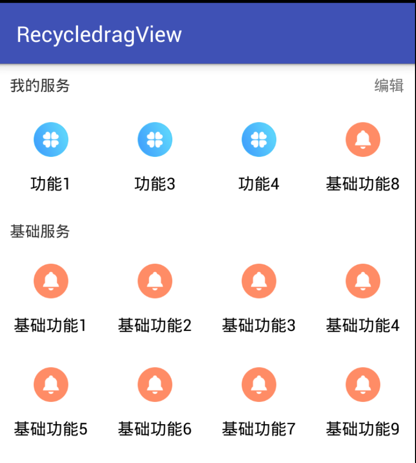
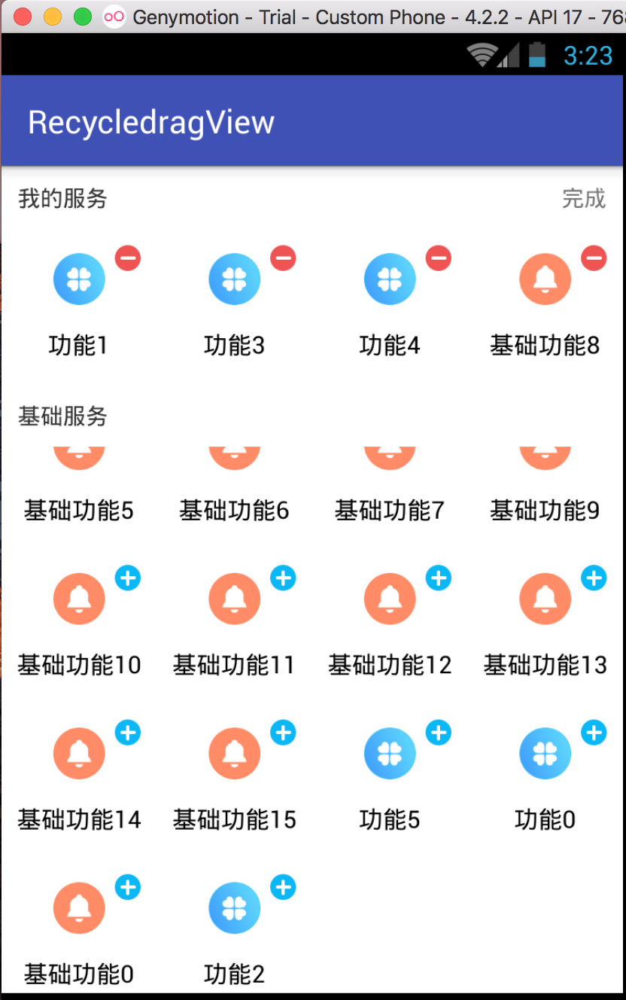
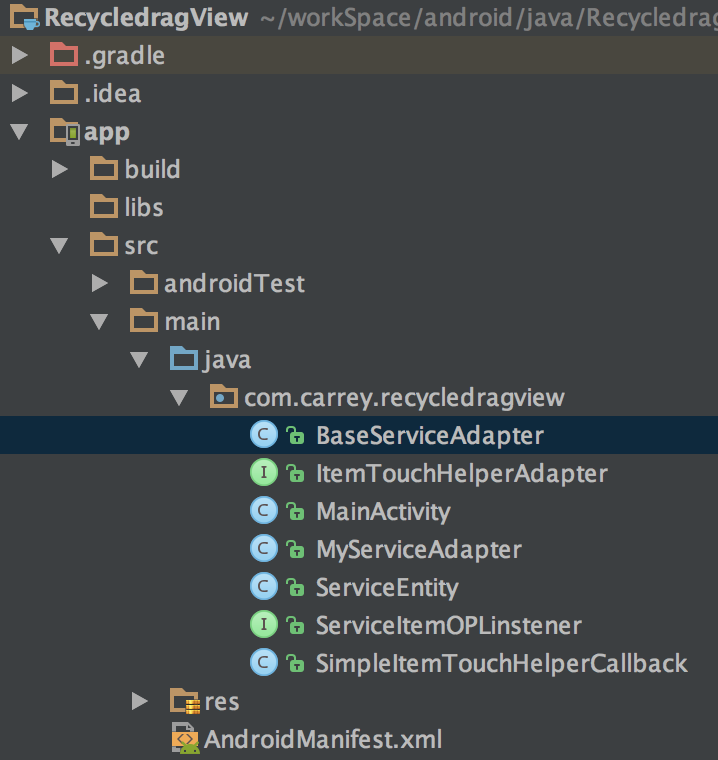

# RecycleViewDragFunction

---

仿支付宝全部应用效果。（类似） 基础服务可以添加到我的服务中。我的服务删除，进入基础服务。

向上滚动。我的服务吸顶。点击编辑进行状态切换。 我的服务可以拖拽排序。

 

不需要其他控件。我们常用的recycleView 就可以实现这个效果。以下为项目的目录结构

mainActivity里面没有什么内容。

``` java
        mMyservice = (RecyclerView) findViewById(R.id.brv_my_service);
        mBaseservice = (RecyclerView) findViewById(R.id.brv_base_service);
        mMyservice.setLayoutManager(new GridLayoutManager(this, 4));
        mBaseservice.setLayoutManager(new GridLayoutManager(this, 4));


        mMyServiceAdapter = new MyServiceAdapter(this, initMyServiceData());
        mMyservice.setAdapter(mMyServiceAdapter);
        ItemTouchHelper.Callback simpleItemTouchHelperCallback = new SimpleItemTouchHelperCallback(mMyServiceAdapter);
        ItemTouchHelper helper = new ItemTouchHelper(simpleItemTouchHelperCallback);
        helper.attachToRecyclerView(mMyservice);

        mBaseServiceAdapter = new BaseServiceAdapter(this, initBaseServiceData());
        mBaseservice.setAdapter(mBaseServiceAdapter);
        mEdit.setOnClickListener(new View.OnClickListener() {
            @Override
            public void onClick(View v) {
                isEdit = !isEdit;
                mEdit.setText(isEdit ? "完成" : "编辑");
                mMyServiceAdapter.setEdit(isEdit);
                mBaseServiceAdapter.setEdit(isEdit);
            }
        });
```

两个recycleView 使用gridView模式。 基础服务和我的服务相比，少了三行代码。

``` java
ItemTouchHelper.Callback simpleItemTouchHelperCallback = new SimpleItemTouchHelperCallback(mMyServiceAdapter);
        ItemTouchHelper helper = new ItemTouchHelper(simpleItemTouchHelperCallback);
        helper.attachToRecyclerView(mMyservice);
```

所以拖拽事件是 在这三行代码控制的。 通过类名我们大概能猜到。是设置条目Item的Touch事件的帮助类回调。然后把这个帮助类绑定到recycleView 上。先看 SimpleItemTouchHelperCallback 它继承于 ItemTouchHelper.Callback 实现了几个方法。

```java
 @Override
    public int getMovementFlags(RecyclerView recyclerView, RecyclerView.ViewHolder viewHolder) {
        int dragFlags = 0;
        if (startMove) {
            dragFlags = ItemTouchHelper.UP | ItemTouchHelper.DOWN | ItemTouchHelper.LEFT | ItemTouchHelper.RIGHT;
        }
        int swipeFlags = 0;
        return makeMovementFlags(dragFlags, swipeFlags);
    }

    @Override
    public boolean onMove(RecyclerView recyclerView, RecyclerView.ViewHolder viewHolder, RecyclerView.ViewHolder target) {
        mAdapter.onItemMove(viewHolder.getAdapterPosition(), target.getAdapterPosition());
        return true;
    }

    @Override
    public void onSwiped(RecyclerView.ViewHolder viewHolder, int direction) {

        mAdapter.onItemDismiss(viewHolder.getAdapterPosition());

    }

    @Override
    public void onSelectedChanged(RecyclerView.ViewHolder viewHolder, int actionState) {
        if (actionState != ItemTouchHelper.ACTION_STATE_IDLE) {
            mAdapter.onItemSelected(viewHolder, viewHolder.getAdapterPosition());
        }
        super.onSelectedChanged(viewHolder, actionState);

    }

    @Override
    public void clearView(RecyclerView recyclerView, RecyclerView.ViewHolder viewHolder) {
        super.clearView(recyclerView, viewHolder);
        mAdapter.onItemViewClear(viewHolder, viewHolder.getAdapterPosition());
    }
```


getMovementFlags可以设置 (idle, swiping, dragging)的几种状态。比如说例子中设置了可以向上下左右拖拽的状态。（下面会详细的讲itemTouchHelper）

我们拖拽时会执行onMove onSelectedChanged clearView onSwiped 等一系列的回调。所以我们自定义了一个接口。ItemTouchHelperAdapter 来监听这些回调。

```jav

public interface ItemTouchHelperAdapter {
    /**
     * 移动交换
     */
    void onItemMove(int fromPosition, int toPosition);
    /**
     * 滑动删除
     */
    void onItemDismiss(int position);
    //item被选中
    void onItemSelected(RecyclerView.ViewHolder viewHolder, int position);
    //item被释放
    void onItemViewClear(RecyclerView.ViewHolder viewHolder, int position);
}

```

 我们只要在适配器中实现这些回调方法。在这些方法中作相应的数据改变。

例如在我的服务adaoter 中实现拖拽排序的数据交换。

```Java

    @Override
    public void onItemMove(int fromPosition, int toPosition) {
        if (fromPosition > toPosition) {
            for (int x = fromPosition; x > toPosition; x--) {
                Collections.swap(mItems, x, x - 1);
                notifyItemMoved(x, x - 1);
            }

        } else {
            for (int x = fromPosition; x < toPosition; x++) {
                Collections.swap(mItems, x, x + 1);
                notifyItemMoved(x, x + 1);
            }
        }
    }
```

### ItemTouchHelper 

---

ItemTouchHelper 是一个强大的工具，来管理RecycleView上的拖动排序，滑动删除的所有的事情。是RecyclerView.ItemDecoration 的子类。ItemDecoration 是什么？翻译过来是条目装饰。其实就是对每个条目做一些特殊的实现。

要使用ItemTouchHelper，你需要创建一个ItemTouchHelper.Callback 。这个接口来监听move 和swipe 事件。这里还是控制view被选中的状态，以及重写默认动画的地方。

主要的回调方法：

> getMovementFlags(RecyclerView recyclerView,    ViewHolder viewHolder)
>
> onMove(RecyclerView recyclerView,ViewHolder viewHolder, ViewHolder target)
>
> onSwiped(ViewHolder viewHolder, int direction)    

如果需要，可以从写两个帮助的方法：从方法名可知，是两个开关方法。

> isLongPressDragEnable()
>
> isItemViewSwipeEnable()

解析getMovementFlags

```Java
@Override
public int getMovementFlags(RecyclerView recyclerView, RecyclerView.ViewHolder viewHolder) {
    int dragFlags = ItemTouchHelper.UP | ItemTouchHelper.DOWN |ItemTouchHelper.LEFT | ItemTouchHelper.RIGHT;
    int swipeFlags = ItemTouchHelper.START|ItemTouchHelper.END;
    return makeMovementFlags(dragFlags, swipeFlags);
}
```

以上 dragFlags 是拖拽方向，swipeFlags 是滑动的方向。以上的方法是设置了四方拖动，左右滑动效果。

接下来我们需要写个接口来onMove 和onSwiped 的事件传递出去。来通知底层数据刷新。

viewHolder.getAdapterPosition() 可以获得当前item的位置position。

``` jav
	@Override
    public boolean onMove(RecyclerView recyclerView, RecyclerView.ViewHolder viewHolder, RecyclerView.ViewHolder target) {
        mAdapter.onItemMove(viewHolder.getAdapterPosition(), target.getAdapterPosition());
        return true;
    }

    @Override
    public void onSwiped(RecyclerView.ViewHolder viewHolder, int direction) {

        mAdapter.onItemDismiss(viewHolder.getAdapterPosition());

    }
```

